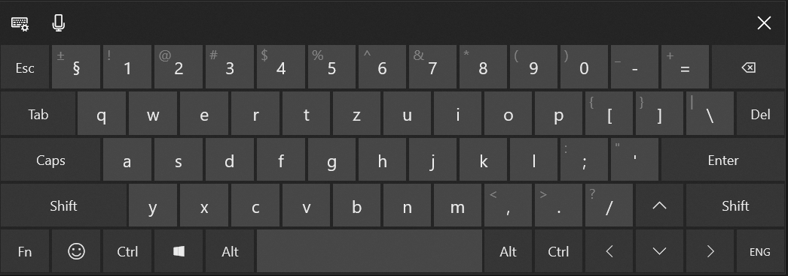
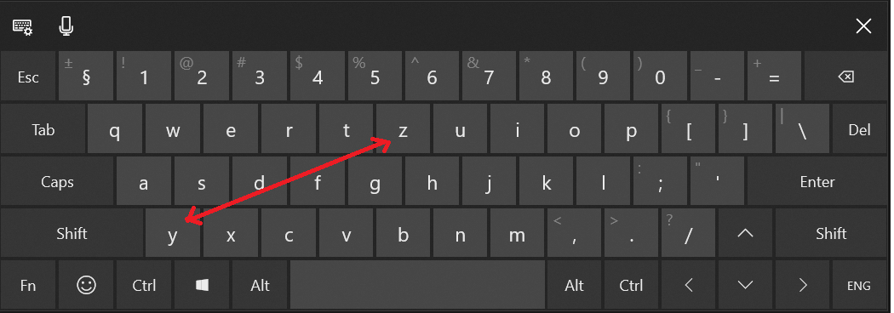
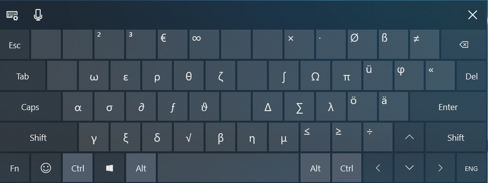
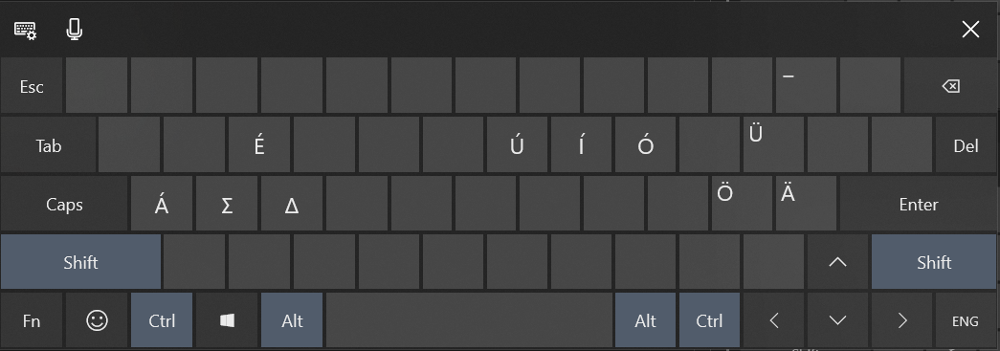
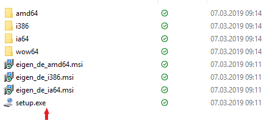
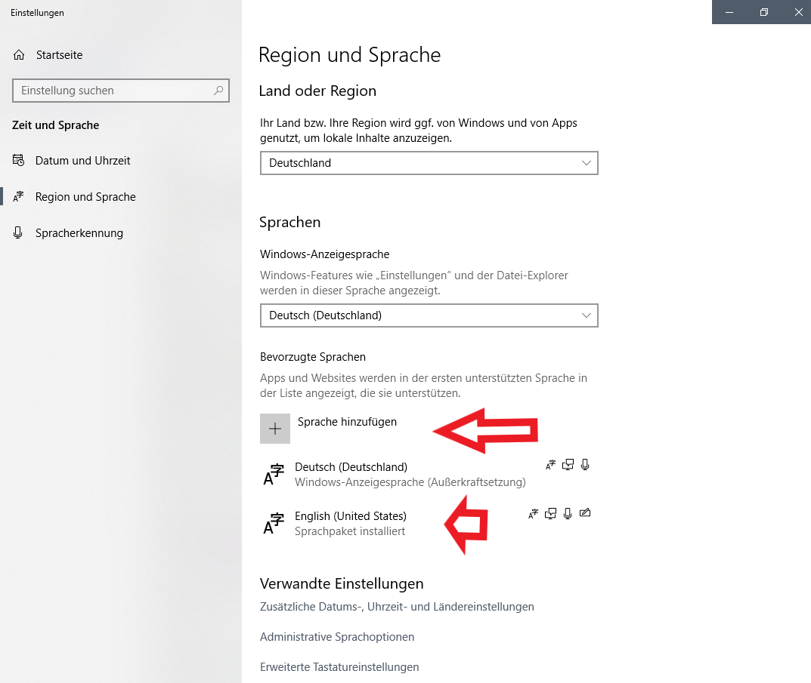
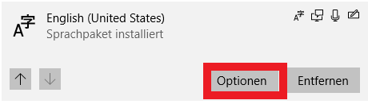
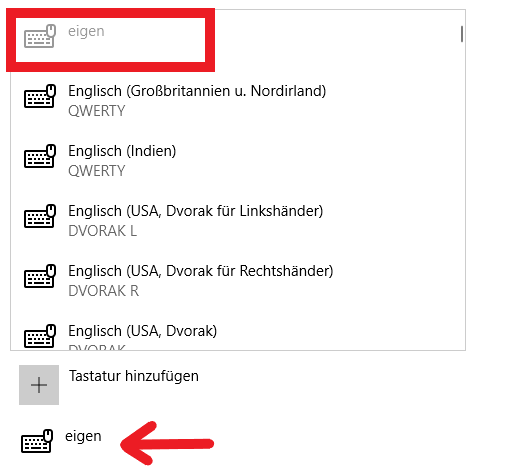
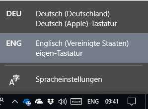

# Ultimate Windows & MacOS Keyboard Layout for Programming, Engineering and Science with Umlauts, Greek and Math Symbols

based on the US International Keyboard and inspired by the MacOS Alt-Keys,
with AltGr-Keys for Greek and Math symbols. 
optimal for Coding and writing Engineering and Science related things.
(still usable for Germans with äöüß etc.).
Made with the MS Keyboard Layout Creator. 
The Source File is in included so you can change it yourself. 
But installing the MS Keyb Layout Cr. requires older .NET Runtimes on Win10.

    number row : ²³€∞× ∙ Øß≠
    first row : ωερθζ∫Ωπüφ 
    second row : ασ∂ƒϑ∆∑λöä«  // EU physical Layout: "«" is here
    third row : γξδ√∫ημ≤≥÷ 
    
Download the Zip file or clone the repository. the Setup files are included.
## Windows Screenshots
Layouts:
German regular 

US Version:

Ctrl+Alt pressed or AltGr (right side)

Ctrl+Alt pressed or AltGr (right side) + Shift

### Installation
regular Setup

    

if not already added, ad the English US Language.

    now you might need to sign out of windows and sign in again

in Options add an new Layout

select the "eigen" Layout

    now you might need to sign out of windows and sign in again

Result: You can shift the Layout with Win+Space quick and easy.
or go to the task bar and change it there. (Screenshot)

 
##  MacOS Screenshots

in Progress , use the Ukulele App.